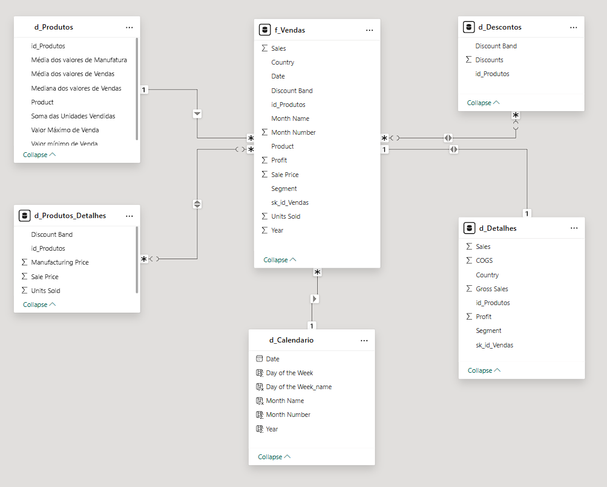

# Resolução do Lab Project: Modelando um Dashboard de E-commerce com Power BI Utilizando Fórmulas DAX
## Bootcamp NTT DATA - Engenharia de Dados com Python

### Introdução
Este repositório contém minha solução para o lab project solicitado no Bootcamp NTT DATA - Engenharia de Dados com Python de acordo com suas regras resumidas abaixo, basedas no arquivo "Descrição do Desafio - Modelagem e Transformação de dados com DAX com Power BI.docx".

Apesar do título sugerir que este desafio se trata de um Dashboard de E-commerce, na verdade se refere ao desenvolvimento de um diagrama dimensional no modelo Star Schema do sample "financials" do Power BI

### Tecnologia

### Descrição do Desafio de Projeto
Utilizaremos a tabela única de Financial Sample para criar as tabelas dimensão e fato do nosso modelo baseado em star schema.
O processo consiste na criação das tabelas com base na tabela original. A partir da cópia serão selecionadas as colunas que irão compor a visão da nova tabela. Sendo assim, a partir da tabela principal serão criadas as tabelas: 
Financials_origem (modo oculto – backup)

D_Produtos (ID_produto, Produto, Média de Unidades Vendidas, Médias do valor de vendas, Mediana do valor de vendas, Valor máximo de Venda, Valor mínimo de Venda)
D_Produtos_Detalhes(ID_produtos, Discount Band, Sale Price,  Units Sold, Manufactoring Price)
D_Descontos (ID_produto, Discount, Discount Band)
D_Detalhes (*)
D_Calendário – Criada por DAX com calendar()
F_Vendas (SK_ID , ID_Produto, Produto, Units Sold, Sales Price, Discount  Band, Segment, Country, Salers, Profit, Date (campos))

*Verifique as informações que não foram contempladas nas demais tabelas dimensão que fornecem maiores detalhes sobre vendas.
Exemplo de tabela criada por agrupamento das informações

Notas:
- Salve seu projeto em um Repositório do Github.
- No repositório inclua:
    - projeto.pbix
    - uma imagem do seu esquema em estrela.
    - Escreva no readme o processo de construção do seu diagrama
    - Etapas e as funcionalidades das funções DAX utilizadas neste projeto.

### Descrição da Resolução  
- Os arquivos deste repositório correspondem às minhas soluções para este desafio de projeto:
    - power-bi_financials_SalesReport_StarSchema.pbix => arquivo do powerbi contendo minha solução para a modelagem Star Schema, solicitada.
    - PowerBI-financials_SalesReport-StarSchema.png => arquivo com a imagem do modelo desenvolvido:

- Neste Lab Project, desenvolvi a modelagem de dados no Star Schema para a base de dados "financials" - que é uma das bases exemplo do PowerBI.
- A partir de uma tabela única, os dados foram separados e extruturados em diferentes tabelas dimensão e tabela de fatos:
    - Tabelas dimensão:
        - d_Produtos
        - d_Produtos_Detalhes
        - d_Descontos
        - d_Detalhes
        - d_Calendario
    - Tabela de fatos:
        - f_Vendas
- O objetivo da análise é o processo de vendas e, por isso, a tabela de fatos reflete essa característica.
- Utilizei as Funções DAX para construir a tabela com datas d_Calendario, algumas das funções são:
    - coluna Date:
        - CALENDAR - indicando data de início e fim do conjunto de dados a ser analisado.
        - Observação: incluí adcionalmente (porém ocultado) a tabela d_Calendario_opcao, com a função CALENDARAUTO - que pode ser mais interessante na condição de atualização automática da base dados.
    
    - Coluna Day of the Week:
        - WEEKDAY, pasando a coluna Date e que retorna o dia da semana em número inteiro (sendo 1 referente ao Domingo)
    
    - Coluna Day of the week_name:
        - FORMAT('d_Calendario'[Date], "DDDD"), retornando o nome do dia da semana correspondente à coluna Date
    
    - Coluna Month Name:
        - Também utliza a função FORMAT:
        - FORMAT('d_Calendario'[Date], "MMMM")
    
    - Coluna Month Number:
        - MONTH('d_Calendario'[Date])

    - Coluna Year:
        - Year = YEAR('d_Calendario'[Date]), que retorna apenas o ano das datas da coluna Date.